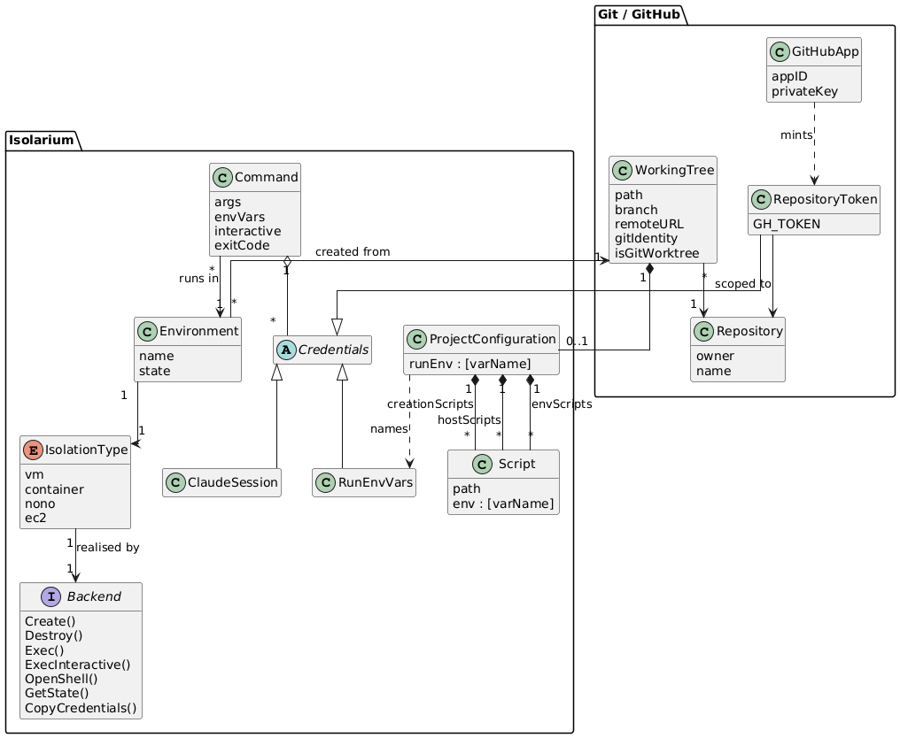

# Domain model

This document names the concepts isolarium is built around, independent of any
one isolation type. Backend-specific concepts (Lima VM templates, Docker
images, EC2 instances, tmux sessions, Terraform state) are described in the
backend's own design document, for example [ec2.md](ec2.md).

# Diagram

Source: [domain.puml](domain.puml). Regenerate with
`run-plantuml.sh docs/design/domain.puml docs/design/domain.png`.

# Concepts

The concepts fall into two packages. **Git / GitHub** holds what isolarium
takes as given: the checkout it is run from, the repository that checkout
belongs to, and the GitHub identity and tokens used to reach it. **Isolarium**
holds what isolarium itself introduces: environments, the isolation types that
realise them, the commands run inside them, and the configuration that shapes
them.

## Package: Git / GitHub

### Working tree

The git checkout isolarium is run from. Every command operates on the current
working tree: `create` places a copy of it (or a mount of it) inside an
environment, and `run` executes commands against that copy. Isolarium reads the
remote URL, current branch, and git identity from the working tree on the host.
A working tree may be a git worktree; backends that mount rather than clone
need to know this so the main repository is reachable too.

### Repository

The GitHub repository the working tree belongs to, identified by owner and
name, parsed from the working tree's remote URL. The repository is the scope of
the credentials isolarium mints: a token is valid for this repository only.

### Repository token

A short-lived GitHub App installation token scoped to one repository, minted
fresh for each `run` (or, for the container backend, extracted from the host's
`gh` session). It is injected as `GH_TOKEN` together with the git configuration
needed to use it, and is never written to disk inside the environment.
`--no-gh-token` disables it.

### GitHub App

The identity that signs repository tokens: an app ID and private key,
configured in `.env.local`. It is separate from the user's personal GitHub
account, so actions the agent takes are attributable to the app rather than to
the user.

## Package: Isolarium

### Environment

An isolated place where commands run. An environment is identified by a
**name** and an **isolation type**. Each isolation type has a default name
(`isolarium`, `isolarium-container`, `isolarium-nono`, `isolarium-ec2`),
overridden with `--name` or `ISOLARIUM_NAME`; the same name may exist under
more than one isolation type, in which case `--type` disambiguates. When
`--type` is not given for an existing name, isolarium detects the type from
the metadata directory.

An environment has a lifecycle: it does not exist, it is being created, it is
running, it may be stopped, and it is destroyed. `status` reports the current
**state** as a string supplied by the backend (`running`, `stopped`, `none`,
…). Host-side metadata for each environment lives under
`~/.isolarium/<name>/<type>/`; the presence of that directory is how isolarium
discovers which environments exist and of what type.

`nono` is the exception: it has no persistent environment and no `create` step.
Each `run` builds a fresh sandbox around the command.

### Isolation type and backend

An **isolation type** is one of the four strategies for isolating an
environment: `vm`, `container`, `nono`, `ec2`. Each is implemented by a
**backend** that satisfies the `Backend` interface
(`internal/backend/backend.go`):

| Method | Meaning |
|---|---|
| `Create` | Provision the environment and place the working tree in it |
| `Destroy` | Tear the environment down |
| `Exec` | Run a non-interactive command, returning its exit code |
| `ExecInteractive` | Run a command with a TTY attached |
| `OpenShell` | Open an interactive shell |
| `GetState` | Report the environment's lifecycle state |
| `CopyCredentials` | Place the host's Claude credentials inside the environment |

The CLI resolves an isolation type to a backend (`ResolveBackend`) and
delegates to it. The domain concepts below are shared by all backends; the
backends differ only in how they realise them.

### Command

What `run` executes inside an environment: an argument vector, a set of
environment variables, and whether a TTY is attached. The command's exit code
is returned to the caller unchanged. `shell` is a command whose argument
vector is the environment's login shell.

### Credentials

Secrets isolarium carries into an environment on behalf of the agent. There
are three kinds, kept separate on purpose:

- **Repository token** — see the Git / GitHub package above.
- **Claude session** — the host's Claude Code credentials, copied into the
  environment so the agent is already signed in (`--copy-session`, on by
  default). `--fresh-login` skips the copy so the agent signs in itself.
- **Run environment variables** — named variables from `pid.yaml`'s
  `run.env` and from `--env`, passed through from the host.

### Project configuration

Per-repository settings in `pid.yaml` at the root of the working tree, keyed
by isolation type. For each type it holds:

- **Creation scripts** — run inside the environment during `create` (for
  example, installing a toolchain).
- **Host scripts** — run on the host after the environment exists.
- **Env scripts** — run inside the environment after the environment exists.
- **Run env** — the names of host environment variables to pass into every
  `run`.

The three script lists hold the same kind of thing, a **script**: a path to a
file in the repository plus the names of host environment variables to make
available to it. A script's path must stay within the repository; isolarium
rejects paths that escape it. Which list a script is in decides where and when
it runs.

### Workflow tools

A set of tools (from `humansintheloop-dev/humansintheloop-dev-workflow-and-tools`)
that give the agent the project's standard workflow. Whether and when they are
installed is a backend decision: the vm backend installs them during `create`,
the container image bakes them in at build time, and the ec2 instance ships
only their prerequisites.

# Relationships

- A **working tree** belongs to one **repository**.
- An **environment** is created from one working tree and holds a copy or
  mount of it. Many environments (of different names or types) may be created
  from the same working tree.
- An environment has exactly one **isolation type**, realised by one
  **backend**.
- A **command** runs inside one environment and is given **credentials**
  scoped to that environment's repository.
- **Project configuration** belongs to the working tree and is consulted by
  `create` and `run` for the environment's isolation type.

# Commands and the concepts they touch

| Command | Concepts |
|---|---|
| `create` | working tree, environment, project configuration (creation and post-creation scripts), repository token (for cloning) |
| `run` | environment, command, credentials, project configuration (run env) |
| `shell` | environment, command, Claude session |
| `destroy` | environment |
| `status` | environment (name, type, state, repository, branch, work directory) |

`clone-repo`, `install-tools` and `install-workflow-tools-from-source` are
internal maintenance commands: each re-runs one step of the vm backend's
`create` after a partial failure, and none of them applies to the other
isolation types. They are not part of the domain model.
