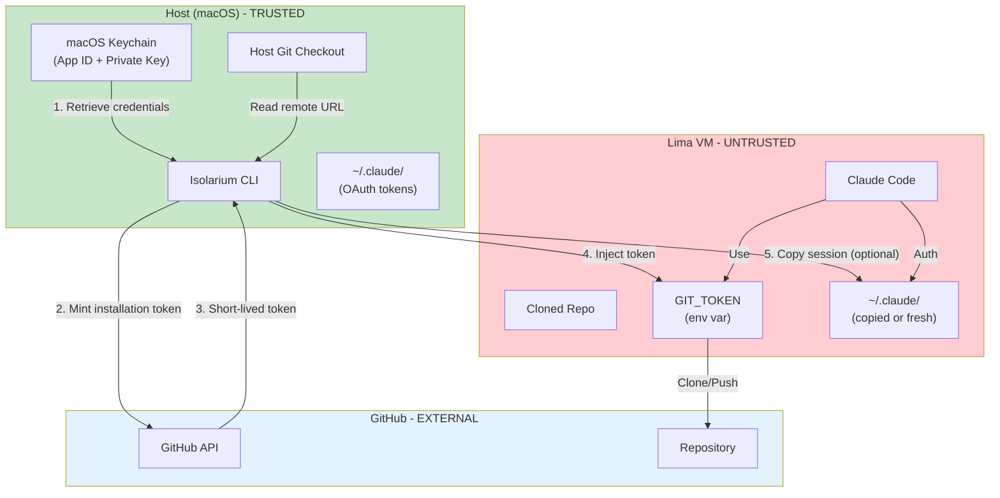
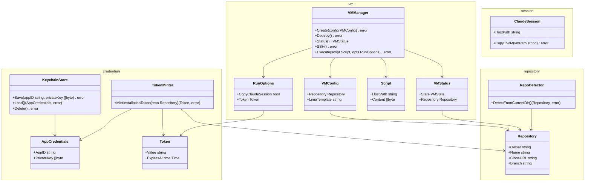
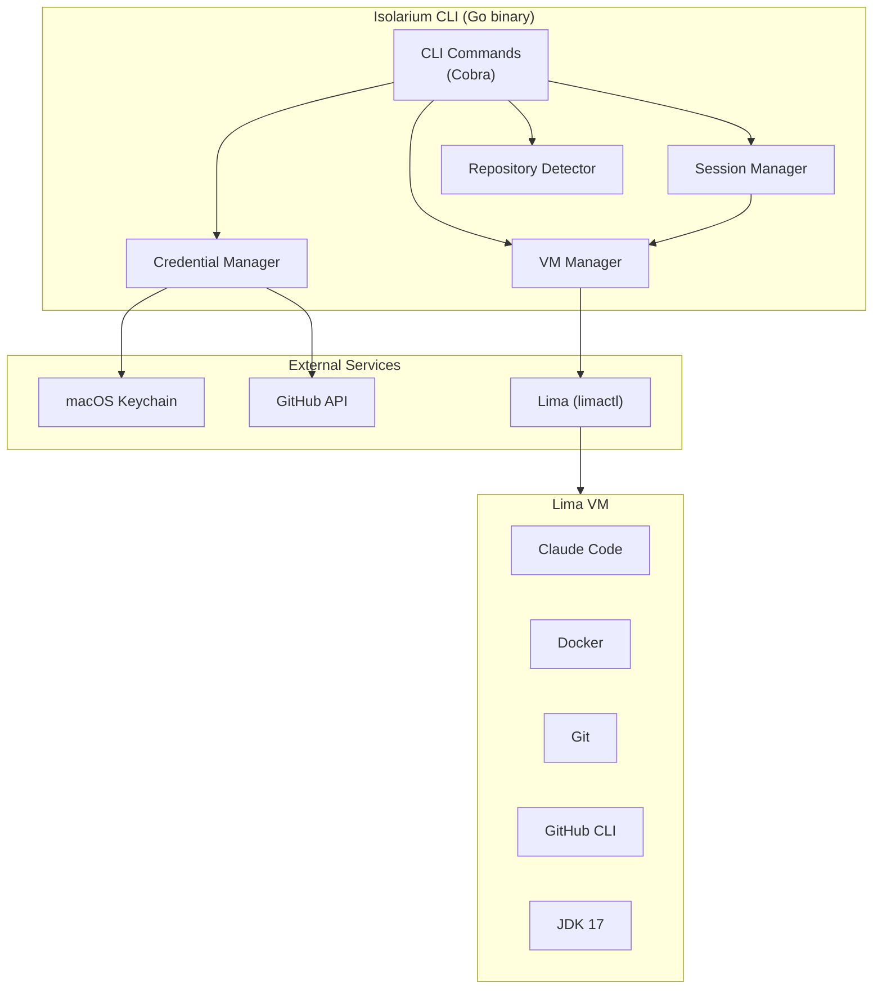
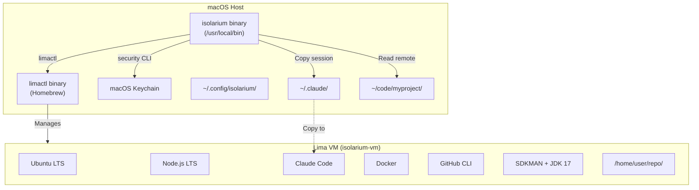
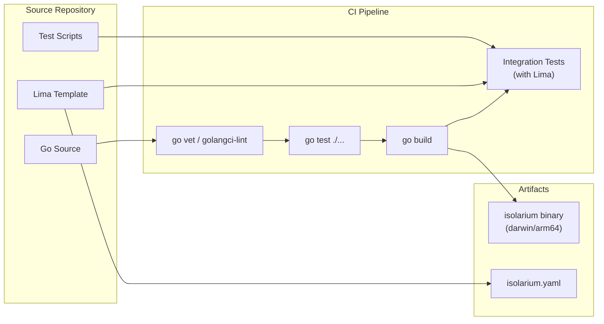

# Isolarium Design Document

## 1. Overview

Isolarium is a CLI tool that provides a secure, isolated execution environment for running Claude Code on macOS. It leverages Lima VMs for isolation and GitHub App installation tokens for repository-scoped credentials.

### Key Goals

1. **Host protection**: VM compromise is acceptable; host compromise is not
2. **Credential scoping**: GitHub tokens are short-lived and limited to a single repository
3. **Identity separation**: The agent uses a GitHub App identity, not the developer's personal identity
4. **Disposability**: Recovery from compromise is achieved by destroying and recreating the VM

### Key Constraints

- macOS only (Apple Silicon optimized)
- Single VM at a time (initially)
- Claude Code only (initially)
- GitHub repositories only
- Requires existing GitHub App (no creation wizard)

### Implementation Language

Go, using:
- Cobra for CLI framework
- go-github for GitHub API interactions
- macOS `security` CLI for Keychain access
- Lima CLI (`limactl`) for VM management

---

## 2. UI/UX View

*Not applicable - Isolarium is a CLI tool with no graphical UI.*

---

## 3. Security Architecture

### 3.1 Security Diagram



### 3.2 Security Elements

| Element | Purpose | Security Property |
|---------|---------|-------------------|
| **macOS Keychain** | Stores GitHub App private key | Protected by macOS security; requires user auth to access |
| **Isolarium CLI** | Orchestrates VM and credentials | Runs on trusted host; handles sensitive operations |
| **GitHub API** | Mints installation tokens | External trust boundary; enforces token scope |
| **Lima VM** | Runs agent in isolation | Untrusted environment; no host filesystem access |
| **GIT_TOKEN env var** | Provides repo access to agent | Short-lived; single-repo scope; never persisted |
| **~/.claude/ session** | Claude Code authentication | Optional copy; user chooses security/convenience tradeoff |

### 3.3 Trust Boundaries

1. **Host ↔ VM**: Strong isolation via Lima VM; no shared filesystem or Docker socket
2. **Host ↔ GitHub**: Authenticated via GitHub App; tokens minted on-demand
3. **VM ↔ GitHub**: Limited to single repo via scoped installation token

### 3.4 Credential Lifecycle

| Credential | Storage | Lifetime | Scope |
|------------|---------|----------|-------|
| GitHub App private key | macOS Keychain | Long-lived | All repos where App installed |
| GitHub installation token | VM env var only | Minutes to hours | Single repository |
| Claude Code session | Copied to VM or fresh | Session-based | User's Claude account |

### 3.5 Threat Mitigations

| Threat | Mitigation |
|--------|------------|
| Compromised agent accesses multiple repos | Tokens scoped to single repo |
| Token persists after session | Tokens not persisted; fresh mint each run |
| Agent accesses host filesystem | No filesystem mounts in VM |
| Agent uses developer's identity | GitHub App identity used, not personal |
| Compromised VM persists | VM is disposable; destroy and recreate |

---

## 4. Domain View

### 4.1 Domain Diagram



### 4.2 Domain Elements

| Element | Subdomain | Responsibility |
|---------|-----------|----------------|
| **KeychainStore** | credentials | CRUD operations for GitHub App credentials in macOS Keychain |
| **AppCredentials** | credentials | Value object holding App ID and private key |
| **TokenMinter** | credentials | Generates JWT from private key, exchanges for installation token |
| **Token** | credentials | Value object for short-lived GitHub installation token |
| **VMManager** | vm | Lifecycle management for Lima VM (create, destroy, execute) |
| **VMConfig** | vm | Configuration for VM creation (repo, template) |
| **VMStatus** | vm | Current state of VM (running, stopped, none) |
| **Script** | vm | User-provided script to execute inside VM |
| **RunOptions** | vm | Options for script execution (session copy, token) |
| **Repository** | repository | GitHub repository identifier (owner/name/branch) |
| **RepoDetector** | repository | Extracts repository info and current branch from host git directory |
| **ClaudeSession** | session | Manages copying Claude Code session into VM |

### 4.3 Subdomain Responsibilities

| Subdomain | Responsibility | Key Patterns |
|-----------|----------------|--------------|
| **credentials** | Secure storage and token minting | Repository pattern for Keychain; Factory for tokens |
| **vm** | VM lifecycle and script execution | Facade pattern for Lima CLI |
| **repository** | Repository detection and identification | Strategy pattern for git remote parsing |
| **session** | Claude Code session management | File copy operations |

---

## 5. Component View

### 5.1 Component Diagram



### 5.2 Component Elements

| Component | Responsibility | Interfaces |
|-----------|----------------|------------|
| **CLI Commands** | Parse user input, orchestrate operations | Cobra command handlers |
| **Credential Manager** | Keychain access, token minting | `Save()`, `Load()`, `MintToken()` |
| **VM Manager** | Lima VM lifecycle | `Create()`, `Destroy()`, `Status()`, `Execute()`, `SSH()` |
| **Repository Detector** | Extract repo from git directory | `DetectFromCurrentDir()` |
| **Session Manager** | Copy Claude session to VM | `CopySession()` |
| **macOS Keychain** | Credential storage | `security` CLI |
| **Lima** | VM management | `limactl` CLI |
| **GitHub API** | Token minting | REST API via go-github |

### 5.3 Inter-component Communication

| From | To | Protocol | Purpose |
|------|-----|----------|---------|
| CLI Commands | Credential Manager | Function call | Store/retrieve credentials |
| CLI Commands | VM Manager | Function call | VM lifecycle operations |
| Credential Manager | Keychain | Shell exec (`security`) | CRUD credentials |
| Credential Manager | GitHub API | HTTPS | Mint installation tokens |
| VM Manager | Lima | Shell exec (`limactl`) | Create/destroy/execute in VM |
| Session Manager | VM Manager | Function call | Copy files into VM |

---

## 6. Deployment View

### 6.1 Deployment Diagram



### 6.2 Deployment Elements

| Element | Type | Purpose |
|---------|------|---------|
| **isolarium binary** | Go executable | Main CLI tool |
| **limactl binary** | Homebrew package | VM management dependency |
| **macOS Keychain** | System service | Credential storage |
| **~/.config/isolarium/** | Directory | Non-secret configuration (future use) |
| **~/.claude/** | Directory | Claude Code session on host |
| **Lima VM** | Virtual machine | Isolated execution environment |
| **Ubuntu LTS** | OS | VM base image |
| **Node.js LTS** | Runtime | Required for Claude Code |
| **Claude Code** | npm package | Coding agent |
| **Docker** | Container runtime | For agent tasks |
| **GitHub CLI** | CLI tool | For agent git operations |
| **SDKMAN + JDK 17** | Runtime | For Java projects |

### 6.3 Lima VM Configuration

The VM is configured via a Lima YAML template with these key properties:

```yaml
# isolarium.yaml (Lima template)
images:
  - location: "https://cloud-images.ubuntu.com/releases/24.04/release/ubuntu-24.04-server-cloudimg-arm64.img"
    arch: "aarch64"

cpus: 4
memory: "8GiB"
disk: "50GiB"

# Security: No host mounts
mounts: []

# Security: No host Docker socket
containerd:
  system: false
  user: false

# Full network access
networks:
  - lima: user-v2

# Provisioning script installs tools
provision:
  - mode: system
    script: |
      # Install base tools
      apt-get update && apt-get install -y curl git docker.io

      # Install Node.js LTS
      curl -fsSL https://deb.nodesource.com/setup_lts.x | bash -
      apt-get install -y nodejs

      # Install GitHub CLI
      curl -fsSL https://cli.github.com/packages/githubcli-archive-keyring.gpg | dd of=/usr/share/keyrings/githubcli-archive-keyring.gpg
      echo "deb [arch=$(dpkg --print-architecture) signed-by=/usr/share/keyrings/githubcli-archive-keyring.gpg] https://cli.github.com/packages stable main" | tee /etc/apt/sources.list.d/github-cli.list > /dev/null
      apt-get update && apt-get install -y gh

      # Install Claude Code
      npm install -g @anthropic-ai/claude-code

  - mode: user
    script: |
      # Install SDKMAN and JDK 17
      curl -s "https://get.sdkman.io" | bash
      source "$HOME/.sdkman/bin/sdkman-init.sh"
      sdk install java 17.0.9-tem
```

### 6.4 Startup Sequence

1. User runs `isolarium create` from a git checkout directory
2. CLI reads repository remote URL from `.git/config`
3. CLI retrieves GitHub App credentials from Keychain
4. CLI mints installation token via GitHub API
5. CLI creates Lima VM: `limactl create --name=isolarium-vm isolarium.yaml`
6. CLI starts Lima VM: `limactl start isolarium-vm`
7. CLI clones repository inside VM using token
8. CLI configures git credentials inside VM

### 6.5 Shutdown Sequence

1. User runs `isolarium destroy`
2. CLI stops VM: `limactl stop isolarium-vm`
3. CLI deletes VM: `limactl delete isolarium-vm`

---

## 7. Build View

### 7.1 Build Pipeline Diagram



### 7.2 Repository Structure

```
isolarium/
├── cmd/
│   └── isolarium/
│       └── main.go                 # Entry point
├── internal/
│   ├── cli/
│   │   ├── root.go                 # Root command
│   │   ├── create.go               # isolarium create
│   │   ├── run.go                  # isolarium run
│   │   ├── destroy.go              # isolarium destroy
│   │   ├── status.go               # isolarium status
│   │   ├── config.go               # isolarium config
│   │   └── ssh.go                  # isolarium ssh
│   ├── credentials/
│   │   ├── keychain.go             # macOS Keychain access
│   │   ├── keychain_test.go        # Unit tests
│   │   ├── token.go                # GitHub token minting
│   │   └── token_test.go           # Unit tests
│   ├── vm/
│   │   ├── manager.go              # Lima VM management
│   │   ├── manager_test.go         # Unit tests
│   │   └── lima.go                 # Lima CLI wrapper
│   ├── repository/
│   │   ├── detector.go             # Git remote detection
│   │   └── detector_test.go        # Unit tests
│   └── session/
│       ├── claude.go               # Claude session management
│       └── claude_test.go          # Unit tests
├── configs/
│   └── isolarium.yaml              # Lima VM template
├── test-scripts/
│   ├── test-cleanup.sh             # Clean up test state
│   ├── test-create-destroy.sh      # Test VM lifecycle
│   ├── test-run-script.sh          # Test script execution
│   ├── test-credential-flow.sh     # Test credential management
│   └── test-end-to-end.sh          # Runs all tests in sequence
├── docs/
│   └── features/
│       └── isolarium/
│           ├── isolarium-idea.md
│           ├── isolarium-discussion.md
│           ├── isolarium-spec.md
│           └── isolarium-design.md
├── go.mod
├── go.sum
├── Makefile
└── README.md
```

### 7.3 Dataflow

```
┌─────────────────────────────────────────────────────────────────────────────┐
│ DEVELOPMENT TIME                                                            │
│                                                                             │
│  Go Source ──────► go build ──────► isolarium binary                       │
│  Lima Template ────────────────────► configs/isolarium.yaml                │
│                                                                             │
└─────────────────────────────────────────────────────────────────────────────┘

┌─────────────────────────────────────────────────────────────────────────────┐
│ SETUP TIME (isolarium config set)                                           │
│                                                                             │
│  User's App ID ─────────┐                                                   │
│  User's Private Key ────┼──► isolarium config set ──► macOS Keychain       │
│                         │                                                   │
└─────────────────────────────────────────────────────────────────────────────┘

┌─────────────────────────────────────────────────────────────────────────────┐
│ RUNTIME (isolarium create + run)                                            │
│                                                                             │
│  .git/config ──► RepoDetector ──► Repository(owner/name)                   │
│                                          │                                  │
│  macOS Keychain ──► CredentialManager ───┼──► GitHub API ──► Token         │
│                                          │                      │          │
│  configs/isolarium.yaml ──► VMManager ───┴──► Lima VM ◄─────────┘          │
│                                                   │                         │
│  --script ./agent.sh ──► Script ─────────────────►│                        │
│                                                   │                         │
│  ~/.claude/ ──► SessionManager ──────────────────►│                        │
│                                                   │                         │
│                                              ┌────▼────┐                   │
│                                              │ VM runs │                   │
│                                              │ script  │                   │
│                                              └─────────┘                   │
└─────────────────────────────────────────────────────────────────────────────┘
```

### 7.4 Build Commands

| Command | Purpose |
|---------|---------|
| `go build -o isolarium ./cmd/isolarium` | Build binary |
| `go test ./...` | Run unit tests |
| `go vet ./...` | Static analysis |
| `golangci-lint run` | Lint checks |
| `./test-scripts/test-end-to-end.sh` | Run integration tests |

### 7.5 CI Pipeline (GitHub Actions)

```yaml
# .github/workflows/ci.yml
name: CI

on:
  push:
    branches: [main]
  pull_request:
    branches: [main]

jobs:
  build:
    runs-on: macos-latest  # Required for Lima

    steps:
      - uses: actions/checkout@v4

      - name: Set up Go
        uses: actions/setup-go@v5
        with:
          go-version: '1.22'

      - name: Install Lima
        run: brew install lima

      - name: Lint
        run: |
          go install github.com/golangci/golangci-lint/cmd/golangci-lint@latest
          golangci-lint run

      - name: Unit Tests
        run: go test ./...

      - name: Build
        run: go build -o isolarium ./cmd/isolarium

      - name: Integration Tests
        run: ./test-scripts/test-end-to-end.sh
```

### 7.6 Testing Strategy

| Test Type | Location | Purpose | Execution |
|-----------|----------|---------|-----------|
| Unit tests | `*_test.go` files | Test individual functions | `go test ./...` |
| Integration tests | `test-scripts/` | Test CLI commands with real Lima | `./test-scripts/test-end-to-end.sh` |

**Testing Guidelines Applied:**
- Integration tests follow `testing-scripts-and-infrastructure` skill guidelines
- Test scripts in `test-scripts/` subdirectory
- `test-end-to-end.sh` runs cleanup first, then all test scripts in sequence
- CI calls `test-end-to-end.sh`, not individual scripts
- Tests execute commands and verify observable outcomes, not file contents

---

## 8. Key Design Decisions

### 8.1 Lima vs Docker for VM

**Decision:** Use Lima VMs instead of Docker containers.

**Rationale:**
- Lima provides true kernel isolation via hypervisor
- Docker containers share the host kernel, which is insufficient isolation for untrusted code
- Lima has first-class macOS support optimized for Apple Silicon
- The spec explicitly calls for "real Linux kernel provides isolation from macOS"

**Trade-off:** VMs have higher startup overhead than containers, but the security benefit outweighs this for autonomous agent execution.

### 8.2 macOS Keychain for Credentials

**Decision:** Store GitHub App private key in macOS Keychain.

**Rationale:**
- Keychain is the most secure credential store on macOS
- Protected by system-level security (TouchID, password)
- iCloud sync provides convenience across machines (per user preference)
- Alternatives (config files, env vars) have weaker security properties

**Trade-off:** macOS-specific; not portable to Linux/Windows. Acceptable given the macOS-only constraint.

### 8.3 Token Minting on Host

**Decision:** Mint GitHub installation tokens on the host, inject into VM as environment variable.

**Rationale:**
- Private key never enters the VM (stays in trusted host Keychain)
- Tokens are short-lived and single-repo-scoped
- If VM is compromised, attacker gets limited token, not the master key
- Fresh token minted on each `run` ensures no stale tokens

### 8.4 User Script Responsibility

**Decision:** User provides a script that handles Claude Code invocation and git operations.

**Rationale:**
- Keeps isolarium focused on environment management
- Allows flexibility in how the agent is invoked
- User can customize git workflow (branching, PR creation)
- Avoids opinionated agent orchestration

### 8.5 Session-Based VM Lifecycle

**Decision:** VM persists across `run` invocations until explicit `destroy`.

**Rationale:**
- Avoids VM creation overhead for each run
- Matches developer workflow (multiple runs during a session)
- User controls when to reset (destroy + recreate)
- Single VM simplifies initial implementation

---

## 9. Technical Risks and Mitigations

| Risk | Impact | Likelihood | Mitigation |
|------|--------|------------|------------|
| Lima startup is slow | Poor UX | Medium | Document expected times; use cached images |
| Keychain access requires password | Interrupts workflow | Low | User can configure Keychain access settings |
| GitHub token expires during long run | Script fails | Medium | Mint longer-lived tokens; document limitation |
| Claude Code session copy exposes host session | Security weakness | Low | Document trade-off; offer `--fresh-login` |
| Lima API changes break integration | Maintenance burden | Low | Pin Lima version; wrapper functions for CLI |
| VM provisioning fails | Create command fails | Medium | Retry logic; clear error messages |

---

## 10. Open Questions

1. ~~**Token lifetime configuration**~~: **Resolved** - Always use GitHub's default token lifetime (1 hour). Keeps implementation simple.

2. **VM image caching**: Should isolarium pre-build and cache a VM image, or always provision from scratch? Pre-built images would be faster but harder to maintain. **Deferred to implementation time.**

3. **Multiple GitHub Apps**: If a user has different GitHub Apps for different repos, should isolarium support multiple credential sets (profiles)? **Deferred to future enhancement.** Initial version supports single credential set only.

4. **Script output persistence**: Should isolarium capture script output to a log file for later review, or only stream to terminal? **Deferred to implementation time.**

5. ~~**Branch handling**~~: **Resolved** - Checkout the current branch of the host repo. The `RepoDetector` will read both the remote URL and current branch from the host's git directory, and clone/checkout that same branch inside the VM. This is consistent with "host directory detection" for repo specification.

---

## Change History

### 2026-02-04: Design review decisions

Resolved open questions during design review:
- **Token lifetime**: Always use GitHub's default (1 hour)
- **VM image caching**: Deferred to implementation time
- **Multiple GitHub Apps**: Deferred to future enhancement; single credential set initially
- **Script output persistence**: Deferred to implementation time
- **Branch handling**: Clone/checkout the same branch as the host repo

Updated domain model:
- Added `Branch` field to `Repository` class
- Updated `RepoDetector` to capture current branch from host git directory
